# Ecommerce

## Project Description:
A website allows customers to view, search, filter the products, add to cart, place an order, checkout, get Mail Notification once order is placed, and an admin interface that enables the shop to manage products, users with role, and orders.
## Tech Stack Used:
    PHP, Laravel, MySQL, Bootstrap, Ajax.
## Website Functions:
### * Customer
```bash
    1. Login and Register
    2. View all Categories
    3. View all Products under specific categories.
    4. Filter all Products by Brands and Price.
    5. View a single product with an image and its details.
    6. Product quantity increment/decrement before adding it to the cart.
    7. Add and display to Cart.
    8. Add and display to Wishlist.
    9. Checkout Page.
    10. Checkout Form validation before placing the order.
    11. Checkout Payments like - Online Paypal.
    12. Mail Notification - User gets a Mail Notification once the order is placed. 
    13. User can view orders.
    14. User Profile
    15. Change Password option
```
### * Admin
```bash
    1. Category CRUD
    2. Product CRUD
    3. Brand CRUD - these brands are linked with products
    4. Color CRUD - these colors are linked with products
    5. User Management CRUD with Role
    6. Order Management
        a) View All Orders List
        b) Filter orders by date and order-status
        c) View each order with user and order details.
        d) Invoice - View each order invoice
        e) Invoice - Download each order invoice as PDF.
        f) Invoice - Mail each order Invoice.
        g) Order- Status - Update your order status (Eg. In-Porgress, Completed, Pending, Cancelled, etc).
    7. All Statistics on Dashboard
        a) Total Orders, Today Orders, this month order, this year order. 
        b) Products, Users, etc.

```

## Some features of the site:
## 1. User
Home Page                   |                   Login Page
:---------------------------------:        |      :------------------------------:
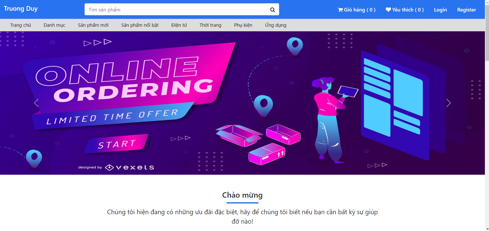  | 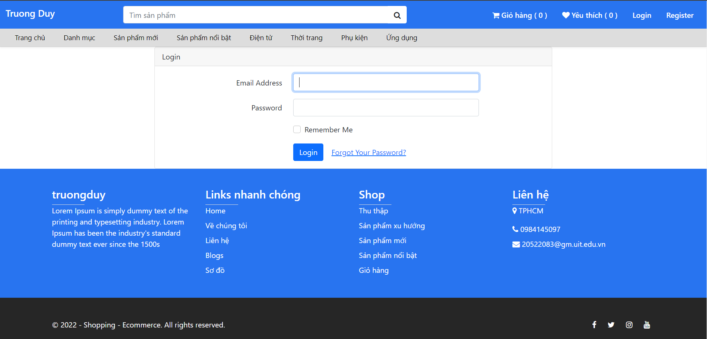

Register Page                  |                   Category Page
:---------------------------------:        |      :------------------------------:
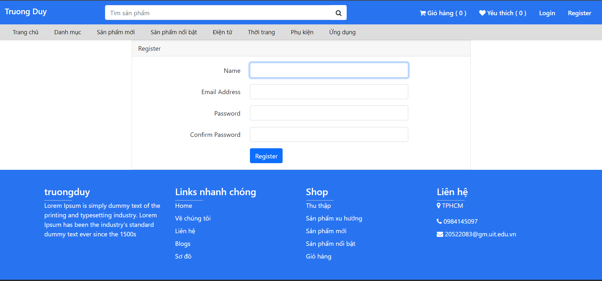  | 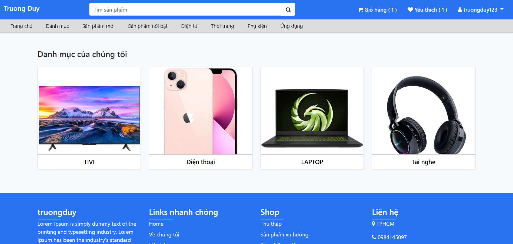

Products                   |                   Detail Product
:---------------------------------:        |      :------------------------------:
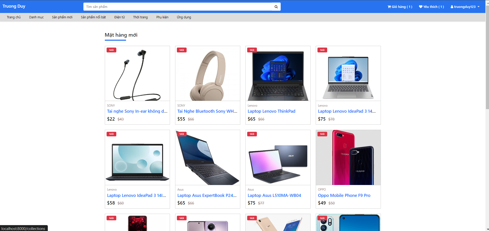  | 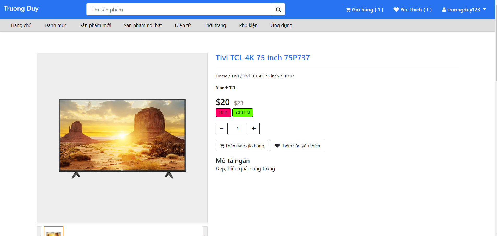

Products By Specific Category                  |                   
:---------------------------------:        
  

Profile                   |                   Change password
:---------------------------------:        |      :------------------------------:
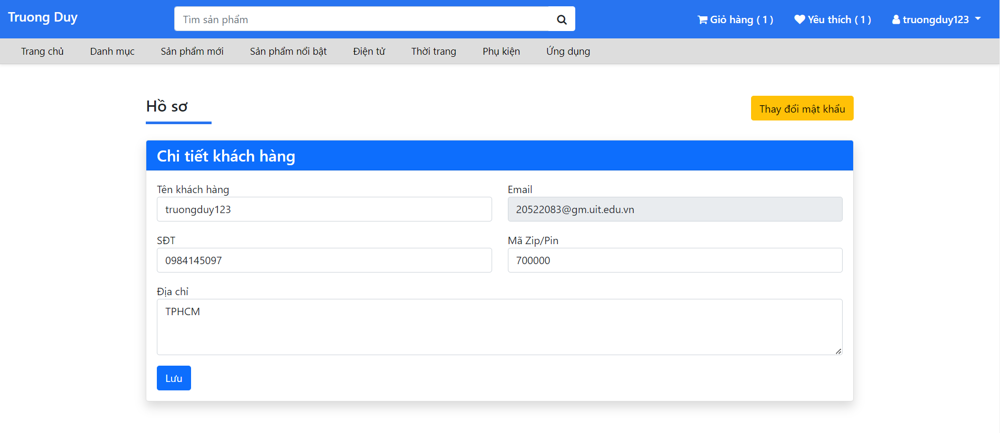  | 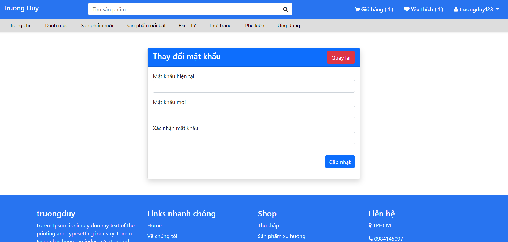

Cart                   |                   Favorite
:---------------------------------:        |      :------------------------------:
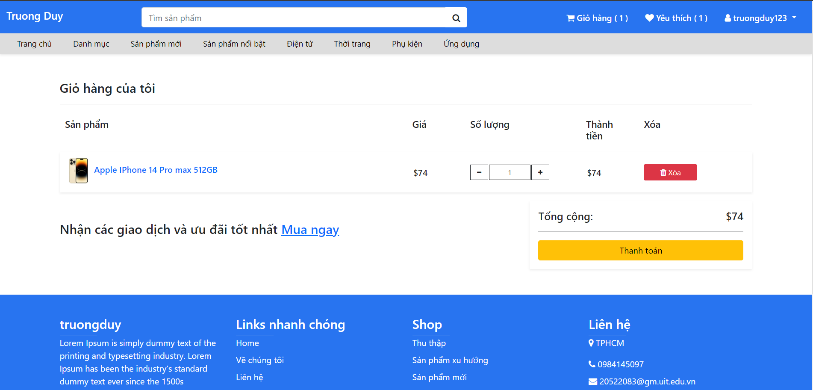  | 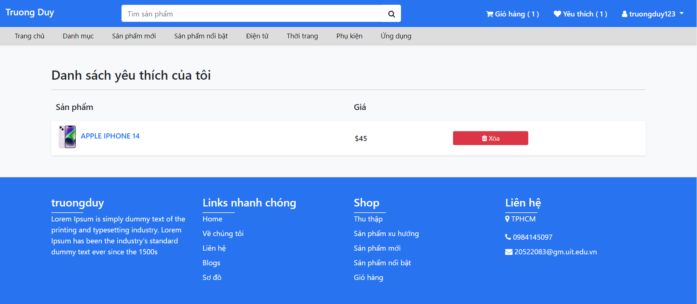

Payment                   |                   My Order
:---------------------------------:        |      :------------------------------:
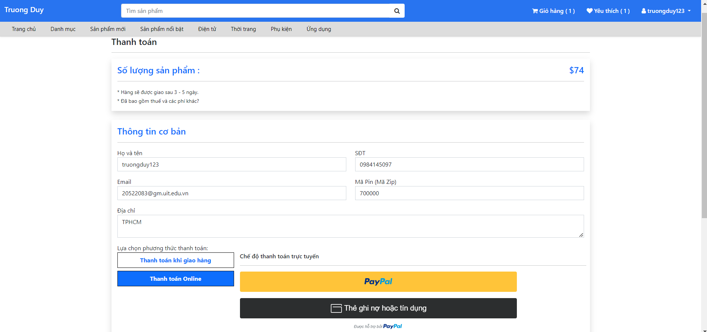  | 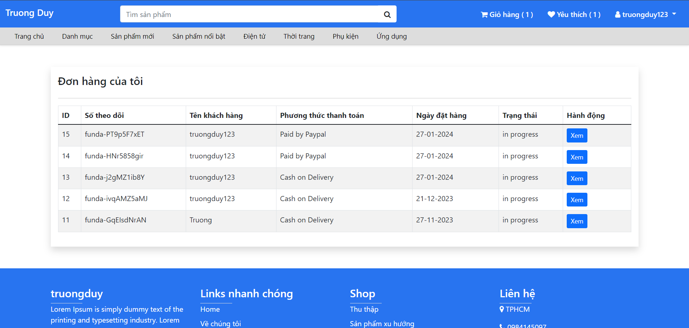

## 2. Admin
Category                   |                   Product
:---------------------------------:        |      :------------------------------:
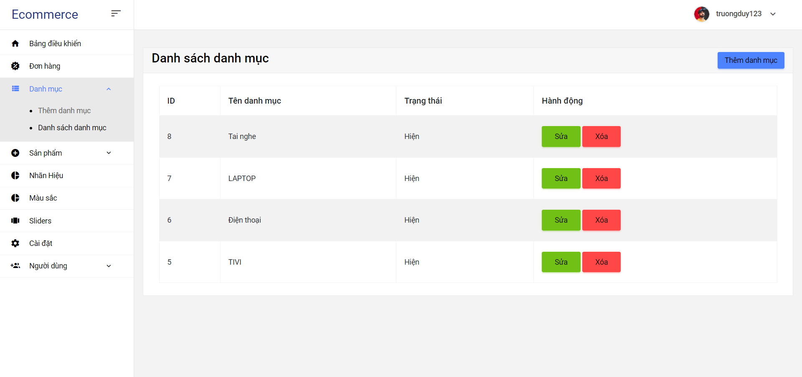  | 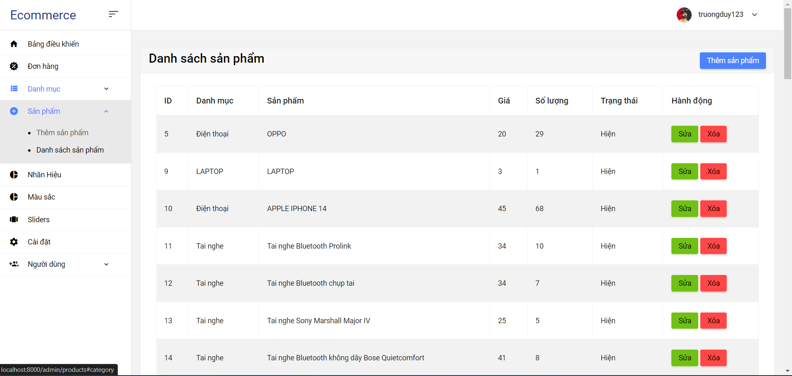

Color                   |                   Brand
:---------------------------------:        |      :------------------------------:
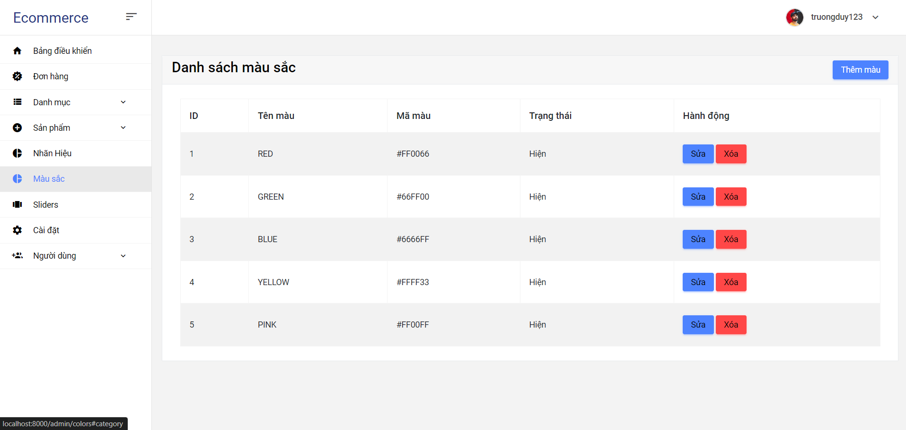  | 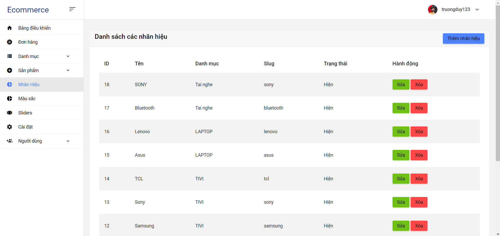

User                   |                   Statistic              
:---------------------------------:        |      :------------------------------:
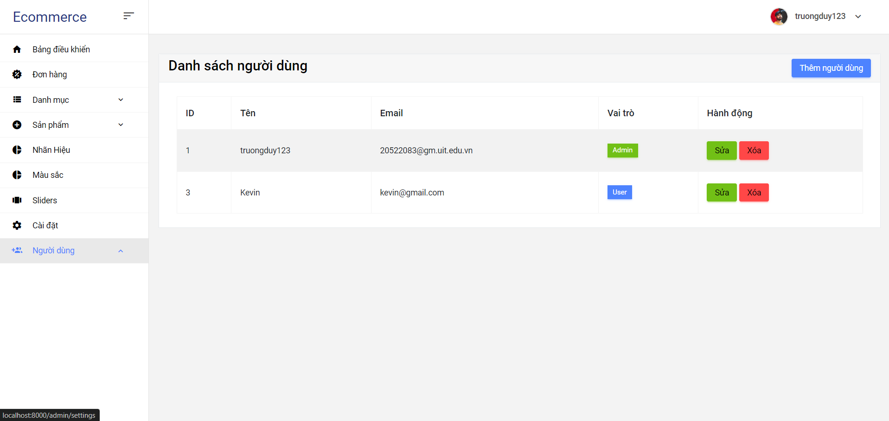  | 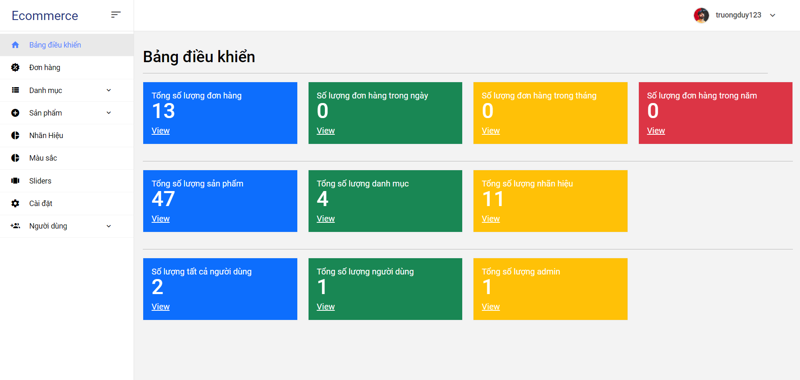

|       Order                               |                               
|---------------------------------|
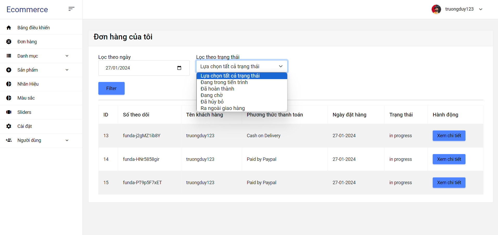  